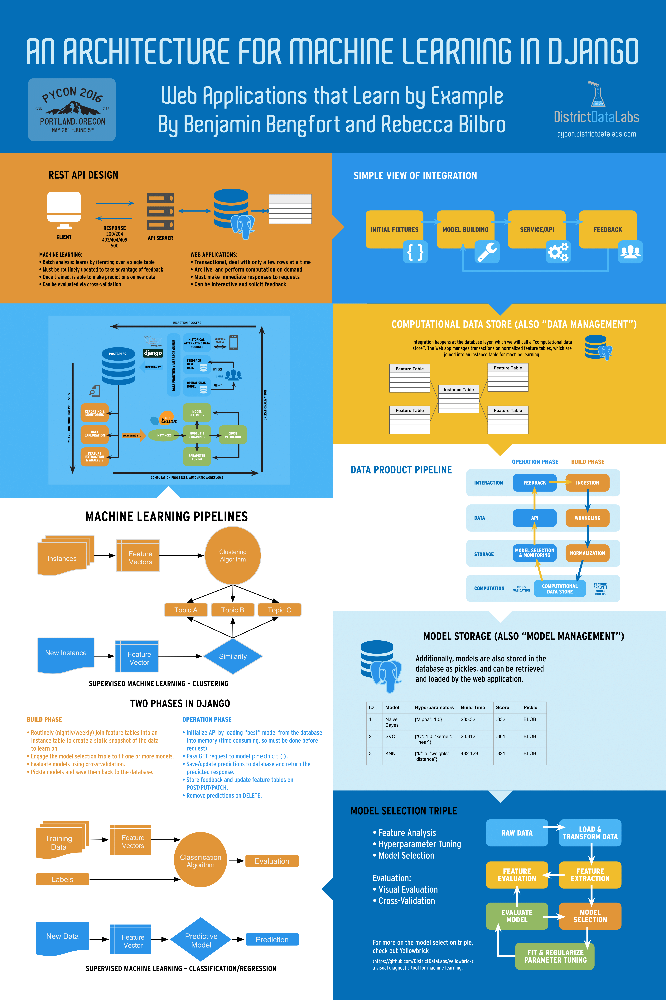

# Architecture

**Here is a high-level overview of the Partisan Discourse architecture:**


### Combining Machine Learning and Django

How and why would someone combine machine learning and Django? Two Partisan Discourse contributors [gave a presentation at PyCon 2016](https://us.pycon.org/2016/schedule/presentation/1614/) about just that:




### Code Base

The Partisan Discourse repository is a Django app that includes a directory for fitting, testing, storing, and operationalizing machine learning models.

Here's what the directory structure looks like:

```
├── LICENSE
├── Makefile
├── Procfile
├── README.md
├── arbiter
│   ├── __init__.py
│   ├── __pycache__
│   ├── admin.py
│   ├── apps.py
│   ├── management
│   ├── migrations
│   ├── models.py
│   ├── tests.py
│   └── views.py
├── bin
│   ├── install_nltk_data
│   └── post_compile
├── corpus
│   ├── __init__.py
│   ├── __init__.pyc
│   ├── __pycache__
│   ├── admin.py
│   ├── apps.py
│   ├── apps.pyc
│   ├── bitly.py
│   ├── exceptions.py
│   ├── fixtures
│   ├── learn.py
│   ├── managers.py
│   ├── migrations
│   ├── models.py
│   ├── nlp.py
│   ├── reader.py
│   ├── serializers.py
│   ├── signals.py
│   ├── tests.py
│   ├── urls.py
│   └── views.py
├── docs
│   ├── img
│   └── index.md
├── manage.py
├── members
│   ├── __init__.py
│   ├── __init__.pyc
│   ├── __pycache__
│   ├── admin.py
│   ├── apps.py
│   ├── apps.pyc
│   ├── migrations
│   ├── models.py
│   ├── permissions.py
│   ├── serializers.py
│   ├── signals.py
│   ├── tests.py
│   ├── urls.py
│   └── views.py
├── mkdocs.yml
├── partisan
│   ├── __init__.py
│   ├── __init__.pyc
│   ├── __pycache__
│   ├── assets
│   ├── settings
│   ├── templates
│   ├── tests
│   ├── urls.py
│   ├── utils.py
│   ├── utils.pyc
│   ├── version.py
│   ├── version.pyc
│   ├── views.py
│   └── wsgi.py
├── requirements.txt
├── runtime.txt
└── venv
    ├── bin
    ├── include
    ├── lib
    ├── man
    └── pip-selfcheck.json

```

To see the code base, head to the **[Github repository](https://github.com/DistrictDataLabs/partisan-discourse).**
